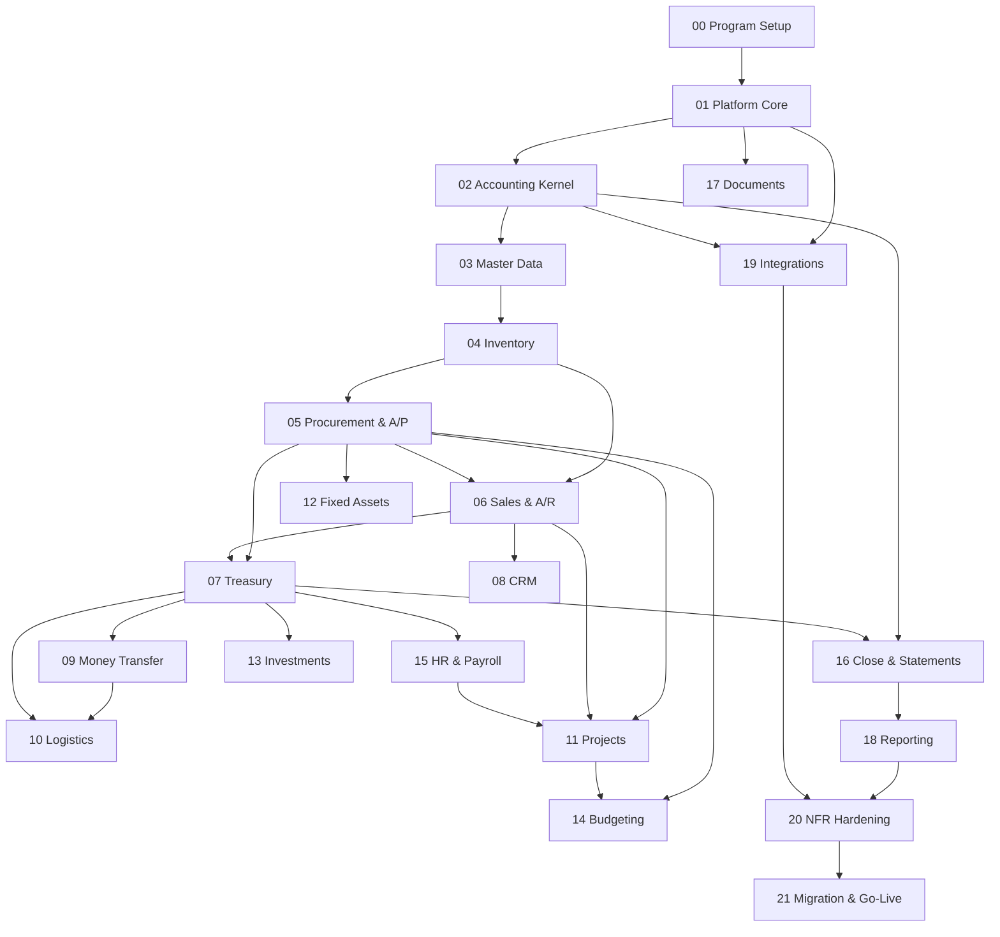

# Build Phases — Master Index

**Project:** Integrated ERP System
**Source of truth:** `ERP Build Map (2).pdf` — *Integrated ERP System Blueprint | Approved Business & Functional Requirements* (45 pages, 28 sections + Appendices A–E)
**Business Process Owner:** Issa Mohammed (§ Document authority and execution rule)

---

## What this is

The blueprint's 45 pages are decomposed into **22 build phases**. Each phase is one markdown file in [`phases/`](phases/). Each phase breaks into **sub-phases**, and every sub-phase carries its own **test gate** that must pass before the next sub-phase starts.

Nothing here changes a business rule, an accounting rule, a workflow or a permission rule. Per the execution rule on page 1, those belong to the Business Process Owner alone. This document sequences *build work* only. Where sequencing required a departure from the roadmap in §27, it is raised as a documented recommendation under §28.2 — see [Structural corrections](#structural-corrections) below.

---

## The rules that govern every phase

### Definition of done (verbatim, p.45)

> A module is complete only when the business workflow works end to end; permissions and approvals are enforced server-side; source documents, subledgers and G/L reconcile; cancellation/reversal is controlled; reports drill to evidence; audit logging is complete; tests pass; users are trained; and the process owner signs acceptance.

Every phase exit gate is a restatement of these nine criteria against that phase's scope. A phase is not done because its screens exist — §27.1: *"No release is complete based only on screen availability."*

### Test-per-sub-phase policy

| Level | What must pass | When |
|---|---|---|
| **Sub-phase gate** | The assertions listed in the sub-phase | Before the next sub-phase begins |
| **Phase gate** | All sub-phase gates + phase exit gate + reconciliation proof | Before the phase is called complete |
| **Release gate** | The acceptance dependency named in §27 for that release | Before promotion to production |

Test gates are written as **assertions to prove**, not as tools to run. Tooling is mapped in [`TECHSTACK.md`](TECHSTACK.md) §B3 once the stack is fixed.

### Delivery rule (§27.1)

For every release, deliver: detailed configuration, data model changes, APIs, permissions, posting mappings, test results, known limitations, as-built documentation.

---

## Phase list

| # | Phase | Blueprint § | Release (§27) | Depends on |
|---|---|---|---|---|
| **00** | [Program Setup & Decision Register](phases/PHASE-00-program-setup.md) | §25, §28 | 1 | — |
| **01** | [Platform Core](phases/PHASE-01-platform-core.md) | §3.4, §5, §21, §24, §25 | 1 | 00 |
| **02** | [Accounting Kernel](phases/PHASE-02-accounting-kernel.md) | §3.3, §14.1–14.4, §24, App. C | 2 ◆ | 01 |
| **03** | [Master Data](phases/PHASE-03-master-data.md) | §4 | 2 | 02 |
| **04** | [Inventory & Warehouse](phases/PHASE-04-inventory.md) | §9 | 3 | 03 |
| **05** | [Procurement & Accounts Payable](phases/PHASE-05-procurement-ap.md) | §8, §15 | 4 | 04 |
| **06** | [Sales & Accounts Receivable](phases/PHASE-06-sales-ar.md) | §7, §16 | 5 | 04, 05 |
| **07** | [Treasury, Bank & Cash](phases/PHASE-07-treasury.md) | §17 | 6 ◆ | 05, 06 |
| **08** | [CRM](phases/PHASE-08-crm.md) | §6 | 5 | 06 |
| **09** | [Money Transfer](phases/PHASE-09-money-transfer.md) | §12 | 6 | 07 |
| **10** | [Logistics](phases/PHASE-10-logistics.md) | §11 | 6 | 07, 09 |
| **11** | [Projects & Contracting](phases/PHASE-11-projects.md) | §10 | 7 | 05, 06, 15 |
| **12** | [Fixed Assets](phases/PHASE-12-fixed-assets.md) | §18 | 9 | 05 |
| **13** | [Investments](phases/PHASE-13-investments.md) | §13 | 7 | 07 |
| **14** | [Budgeting & Management Accounting](phases/PHASE-14-budgeting.md) | §19 | 9 | 05, 11 |
| **15** | [HR, Payroll, Expenses & Advances](phases/PHASE-15-hr-payroll.md) | §20 | 9 | 07 |
| **16** | [Period Close & Financial Statements](phases/PHASE-16-close-statements.md) | §14.5–14.8 | 8 | 02, 07, all subledgers |
| **17** | [Document Management & Collaboration](phases/PHASE-17-documents.md) | §21 | 10 | 01 |
| **18** | [Reporting, Dashboards & BI](phases/PHASE-18-reporting.md) | §22, App. D | 10 | all |
| **19** | [Integrations & APIs](phases/PHASE-19-integrations.md) | §23 | 10 | 01, 02 |
| **20** | [Non-Functional Hardening](phases/PHASE-20-nfr-hardening.md) | §25 | 10 | all |
| **21** | [Migration, UAT, Training & Go-Live](phases/PHASE-21-migration-golive.md) | §26 | 10 | all |

◆ = re-sequenced from §27. See below.

---

## Dependency graph

**Critical path:** 00 → 01 → 02 → 03 → 04 → 05 → 06 → 07 → 09 → 10 → 16 → 18 → 20 → 21

**Parallelisable once Phase 07 completes:** 08 (CRM), 11 (Projects), 12 (Fixed Assets), 13 (Investments), 14 (Budgeting), 15 (HR), 17 (Documents), 19 (Integrations) — these have no dependency on one another.

---

## Structural corrections

Two items in the §27 roadmap are internally inconsistent as a *build* sequence. Both are raised under §28.2 (clarification process): the issue and the options are documented here; the Business Process Owner approves the final treatment. No business rule, accounting treatment or permission is affected.

### C1 — The General Ledger must precede Release 3, not follow it

**Current behaviour (§27):** Release 8 delivers "Journal Entry, recurring journals, bank reconciliation, period close, year-end close and financial statements."

**The inconsistency:** Release 3's own acceptance dependency is *"Inventory subledger and G/L reconcile."* Release 4's is *"Source documents, supplier ledger and G/L reconcile."* Release 5's is *"Stock, customer ledger, revenue and COGS reconcile."* None of these gates can be met without a General Ledger and a posting engine, which Release 8 has not yet delivered.

**Recommendation:** Split Release 8. The **accounting kernel** — Chart of Accounts, fiscal periods, currency and rates, dimensions, Journal Entry, posting engine, reversal, Trial Balance — becomes **Phase 02**, delivered inside Release 2 alongside Master Data. The remainder — recurring journals, soft close, year-end close, FX revaluation, financial statements — stays in Release 8 as **Phase 16**.

**Impact if not corrected:** Releases 3 through 7 cannot pass their own acceptance gates, or they pass on an inventory-quantity basis only and the accounting is retrofitted later — which contradicts §1.1 ("automatic posting from approved operational documents") and §24 (atomic posting).

### C2 — Treasury bank operations must precede Release 6

**Current behaviour (§27):** Release 8 delivers bank reconciliation; Release 6 delivers Money Transfer.

**The inconsistency:** Release 6's acceptance dependency is *"Client balances, bank ledger, service margin and G/L reconcile."* §12.5 requires a Bank Execution Batch whose total *"shall reconcile to the single bank-statement amount"*, and §12.7 requires *"Transfer-to-Bank Statement Reconciliation"*. Bank statement import and the reconciliation workspace must exist before Money Transfer can be accepted.

**Recommendation:** Bank and cash account operations, payment/receipt execution, statement import and the reconciliation workspace become **Phase 07**, delivered before Money Transfer.

**Impact if not corrected:** Money Transfer ships without the reconciliation control that §12.7 makes an acceptance criterion — the highest-risk module in the blueprint shipping without its primary control.

### C3 — CRM is not on the critical path (informational, no change requested)

§7 states *"Sales begins directly with a Sales Order"* and §6 states *"A lead can exist without an approved Business Partner; a Sales Order, Project, invoice or service transaction cannot."* CRM therefore feeds Sales but does not gate it. Phase 08 is scheduled after Phase 06 and can slip without affecting order-to-cash. Recorded so the sequencing is deliberate rather than accidental.

---

## Open decisions blocking build

The blueprint explicitly withholds these. Each blocks the phase named. Tracked in full in [`phases/PHASE-00-program-setup.md`](phases/PHASE-00-program-setup.md).

| # | Decision | Blueprint | Blocks | Owner |
|---|---|---|---|---|
| D1 | Project revenue-recognition and cost-recognition policy; WIP treatment | §10 — *"Finance must approve … IT must not invent the accounting treatment"* | Phase 11.10 | Finance / BPO |
| D2 | Investment categories, valuation methods and frequency, posting rules | §13 — *"implement configurable types and posting rules only after Finance defines the required categories"* | Phase 13.1, 13.5 | Finance / BPO |
| D3 | Payroll formulas, statutory deductions, benefits | §20 — *"Payroll shall not be programmed from assumptions"*; requires signed HR/Finance specification | Phase 15.9 | HR + Finance / BPO |
| D4 | Availability target, maintenance window, RPO, RTO, backup retention | §25 — all marked *"to be confirmed"* | Phase 20.3 | BPO |
| D5 | Target concurrent users, annual transaction volumes, attachment volume, integration throughput, retention horizon | §25 — *"before sizing"* | Phase 20.2, infrastructure sizing | BPO |
| D6 | Accessibility level to be targeted | §25 — *"a recognised web accessibility level selected by the company"* | Phase 20.5 | BPO |
| D7 | Chart of Accounts structure and account codes | App. C — *"Exact account codes and account names are selected through Accounting Mapping after the Chart of Accounts is configured by Issa Mohammed"* | Phase 02.1, all posting mappings | BPO |
| D8 | Cut-over date, historical data depth, archive approach | §26 | Phase 21.1 | BPO |
| D9 | Legal/compliance approval for Money Transfer as a regulated service | §26 go-live gate 5 | Phase 21 exit | Legal / BPO |

**D7 is the most urgent.** Phase 02 cannot complete and no posting mapping in Appendix C can be configured until the Chart of Accounts exists.

---

## Traceability

Every sub-phase cites the blueprint section it implements. Coverage of all 28 sections and 5 appendices:

| Blueprint | Phase |
|---|---|
| §1 Executive Summary and Target Outcome | 00 |
| §2 Business Profile and Scope | 00, 03 |
| §3 Core Architecture and Integration Principles | 01, 02 |
| §4 Organisation Structure, Dimensions and Master Data | 03 |
| §5 Security, Users, Roles, Workflow and Audit | 01 |
| §6 CRM and Customer Management | 08 |
| §7 Sales and Order-to-Cash | 06 |
| §8 Procurement and Procure-to-Pay | 05 |
| §9 Inventory and Warehouse Management | 04 |
| §10 Projects and Contracting | 11 |
| §11 Logistics Operations | 10 |
| §12 Money Transfer Service | 09 |
| §13 Investment Management | 13 |
| §14 Core Financials and General Ledger | 02, 16 |
| §15 Accounts Payable | 05 |
| §16 Accounts Receivable and Credit Control | 06 |
| §17 Treasury, Bank and Cash Management | 07 |
| §18 Fixed Assets | 12 |
| §19 Budgeting, Cost Control and Management Accounting | 14 |
| §20 HR, Payroll, Employee Expenses and Advances | 15 |
| §21 Document Management, Notifications and Collaboration | 01, 17 |
| §22 Reporting, Dashboards and Business Intelligence | 18 |
| §23 Integrations, APIs and Technical Interfaces | 19 |
| §24 Data Architecture, Statuses and Posting Engine | 01, 02 |
| §25 Non-Functional Requirements | 00, 01, 20 |
| §26 Migration, Testing, Training and Go-Live | 21 |
| §27 Implementation Roadmap | this document |
| §28 Implementation Governance and Controlled Change | 00 |
| App. A Approved ERP Menu Tree | 01 (shell), each module phase |
| App. B Document and Status Catalogue | 01 (status machine), each module phase |
| App. C Approved Accounting Posting Matrix | 02 (engine), each module phase |
| App. D Report Catalogue | 18 |
| App. E Reference Basis | 00 |

---

*Related: [`TECHSTACK.md`](TECHSTACK.md) — technical constraints the blueprint imposes on any stack.*
